# Agent Skills Repository



## 🌐 Interactive Portal Terminal
Explore modules, view details, compile custom instruction prompts, and decrypt case studies interactively at the live production endpoint:
👉 **[https://gurtejhundal.github.io/agentSkill/](https://gurtejhundal.github.io/agentSkill/)**

---

## ⚡ The Project Mission
Generic coding assistants fail at complex web design tasks because they start modifying code before inspecting structures, treat mobile viewports as cropped desktops, break scroll timelines, ignore accessibility gates, and mark sprints complete without live deployment verification.

This repository hosts **24 specialized agent skills** (checklists, triggers, context templates, and prompt interfaces) that elevate AI coding agents into specialist roles:
- **Reconstruct** responsive layouts dynamically without deleting visual features.
- **Engineer** robust cinematic scroll animations and transitions.
- **Audit** keyboard interactions, semantic accessibility, and visual QA differences.
- **Deploy** stable, validated, and cached production states with zero drift.

---

## 🛠️ How to Install a Specific Skill
This repository is completely **modular**. You do **not** need to install any full-stack dependencies, Node.js packages, or website scripts to use these skills. Each agent folder is completely portable and self-contained.

### Option A: Import globally into Antigravity
To make a skill available to your global Antigravity coding assistant:
1. Locate the skill folder you want (e.g., `agents/designer-mobile`).
2. Copy that folder directly into your global customizations directory:
   `C:\Users\<username>\.gemini\config\skills\` (Windows) or `~/.gemini/config/skills/` (macOS/Linux).
3. The skill will be automatically discovered and loaded next time you start Antigravity!

### Option B: Project-level workspace import
To make a skill available to agents working on a specific project repository:
1. Create a `.agents/skills/` directory at your project root.
2. Copy the desired skill folder (e.g. `agents/designer-mobile`) into `.agents/skills/`.
3. Your local development subagents can now use this skill!

---

## 🖥️ Directory Structure
```text
website-agent-skills-repo/
├── agents/             # The 24 independent, self-contained agent skill folders
│   ├── designer-mobile/
│   ├── motion-architect/
│   └── ...all 22 other skills
│
├── workflows/          # Coordinated routing pipelines & index.json
├── checklists/         # Verification protocols (mobile, performance, WCAG)
├── templates/          # Context request templates & completion report outlines
├── schemas/            # JSON schemas enforcing formatting rules
├── examples/           # Case studies containing markdown blueprints and prompts
│
└── docs/               # Single-file Cyberpunk Portal (index.html)
```

---

## 🧬 System Modules (24 Active Skills)

### 📊 Strategy & Design
* [design-me](agents/design-me) - **Creative Design Audit**: Audits layouts and redesigns websites while preserving brand identity.
* [design-system-extractor](agents/design-system-extractor) - **Design System Extractor**: Extracts color tokens, variables, margins, and type rules.
* [content-hierarchy](agents/content-hierarchy) - **Content Hierarchy Specialist**: Coordinates text content layout, heading hierarchy, and reading flows.
* [ux-conversion-strategist](agents/ux-conversion-strategist) - **UX Conversion Strategist**: Guides user layouts to drive booking, actions, and leads.

### 📱 Responsive & Layouts
* [designer-mobile](agents/designer-mobile) - **Mobile Design Reconstruction**: Reconstructs layouts for small widths without shrinking or deleting elements.
* [typography-director](agents/typography-director) - **Typography Direction**: Pairs multilingual serifs, establishes line-heights, and corrects overflows.
* [media-fit-specialist](agents/media-fit-specialist) - **Media Fitting**: Adapts aspect ratios, source crop boundaries, and object cover styles.
* [component-refactor](agents/component-refactor) - **Component Refactor**: Splits large UI templates into reusable modular layouts.

### 🎬 Motion & Transitions
* [3d-animation](agents/3d-animation) - **Purposeful 3D Animation**: Coordinates performant Three.js/WebGL states with 2D fallbacks.
* [motion-architect](agents/motion-architect) - **Motion Architecture**: Designs entrances, parallax, and reveals.
* [scroll-systems-engineer](agents/scroll-systems-engineer) - **Scroll Systems Engineering**: Customizes scroll triggers, Lenis scrolling, and snapping.
* [route-transition-designer](agents/route-transition-designer) - **Route Transition**: Builds shared-element morphing page routes transitions.

### 🏛️ Architecture Systems
* [codebase-recon](agents/codebase-recon) - **Codebase Reconnaissance**: Maps folders, dependencies, styles, and configurations.
* [backend-admin-preserver](agents/backend-admin-preserver) - **Backend Admin Preservation**: Safeguards backend routing, auth states, and admin panel forms.
* [asset-optimizer](agents/asset-optimizer) - **Asset Optimization**: Compresses layout assets, source sets, and formats (WebP, webfonts).
* [performance-optimizer](agents/performance-optimizer) - **Performance Optimization**: Bundles scripts, optimizes stylesheets, and speeds up load times.

### 🏥 Domain UX Specialties
* [automotive-ux](agents/automotive-ux) - **Automotive UX**: Optimizes car detailing packages layout, booking triggers, and CTAs.
* [healthcare-ux](agents/healthcare-ux) - **Healthcare UX**: Simplifies portal flows, emergency info pages, and OPD tables.
* [seo-local-search](agents/seo-local-search) - **SEO & Local Search**: Implements local Business schemas, sitemaps, and OG meta.

### 🧪 QA & Verification
* [accessibility-auditor](agents/accessibility-auditor) - **Accessibility Auditing**: Verifies WCAG contrast, screen-reader landmarks, and tab locks.
* [visual-qa-agent](agents/visual-qa-agent) - **Visual QA Auditing**: Compares code outputs against specs using image differentials.
* [interaction-qa-agent](agents/interaction-qa-agent) - **Interaction QA Auditing**: Automates browser checks, forms click checks, and states tests.
* [deployment-verifier](agents/deployment-verifier) - **Deployment Verification**: Asserts that live production matches local configurations.

---

## 🚦 Routing Pipelines (Workflows)
Pipelines coordinate complex, multi-agent sprints. You can compile instructions for these pipelines dynamically on the [Interactive Portal Terminal](https://gurtejhundal.github.io/agentSkill/):
1. **Full Website Audit** (`codebase-recon` ➔ `design-me` ➔ `visual-qa-agent`)
2. **Mobile Reconstruction** (`codebase-recon` ➔ `designer-mobile` ➔ `visual-qa-agent`)
3. **Cinematic Motion** (`codebase-recon` ➔ `motion-architect` ➔ `interaction-qa-agent`)
4. **Route Transition** (`codebase-recon` ➔ `route-transition-designer` ➔ `interaction-qa-agent`)
5. **Portfolio Workflow** (`codebase-recon` ➔ `portfolio-ux` ➔ `designer-mobile`)
6. **Automotive Workflow** (`codebase-recon` ➔ `automotive-ux` ➔ `seo-local-search`)
7. **Healthcare Workflow** (`codebase-recon` ➔ `healthcare-ux` ➔ `accessibility-auditor`)
8. **Release Gate** (`visual-qa-agent` ➔ `interaction-qa-agent` ➔ `deployment-verifier`)

---

## ⚙️ Compilation & Automation
If you modify the source skill markdown files or metadata files, you can update the embedded database block in the portal page directly:

```bash
# Aggregates raw files and compiles them into docs/index.html
npm run build:docs

# Regenerates the SKILLS_INDEX.md category table
npm run generate:index

# Validates skill file formats against schema definitions
npm run validate
```

---

## 🔓 License
This project is licensed under the MIT License. System active.

---

## 👤 Creator
Designed and compiled by **Gurtejbirsingh**. Check out my work and portfolio:
👉 **[https://gurtejbirsingh.vercel.app/](https://gurtejbirsingh.vercel.app/)**

