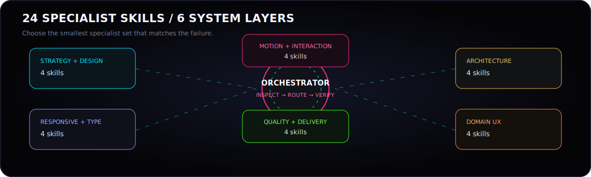

<div align="center">


# Website Agent Skills

**A modular operating system of 24 specialist AI-agent skills for serious website design, responsive reconstruction, motion engineering, domain UX, testing, and production verification.**

[](agents)
[](workflows)
[](LICENSE)
[](https://gurtejhundal.github.io/agentSkill/)

[**Open the interactive portal**](https://gurtejhundal.github.io/agentSkill/) · [Browse all skills](agents) · [View workflows](workflows) · [Use a request template](templates/AGENT_REQUEST_TEMPLATE.md)

</div>

---

## Why this repository exists

Generic coding agents repeatedly fail on serious website work for the same reasons: they modify code before understanding the repository, treat mobile as a cropped desktop, force every asset into one ratio, stack incompatible animation systems, ignore accessibility, and declare completion after a successful build without testing the interface or verifying the production deployment.

This repository replaces that vague “frontend agent” model with **small, explicit specialist roles**. Each skill defines:

- exactly when it should be activated;
- what it must inspect before changing code;
- a disciplined implementation workflow;
- shortcuts it is forbidden to take;
- measurable acceptance criteria;
- evidence required before reporting completion;
- the next specialist to receive the handoff.

The result is not a collection of aesthetic prompts. It is an **agent execution framework** for moving from inspection to verified production output.



---

## Core operating model

```text
User request
     ↓
Codebase reconnaissance
     ↓
Design, responsive, motion, architecture, or domain specialist
     ↓
Focused implementation
     ↓
Visual, interaction, accessibility, and performance verification
     ↓
Production deployment verification
```

No specialist is allowed to skip directly from a vague request to “done.” The default sequence is:

```text
Inspect → Diagnose → Prioritize → Implement → Build → Test → Capture → Compare → Verify production
```



---

## The 24 specialist skills

### Strategy and design

| Skill | What it does |
|---|---|
| [`designer-me`](agents/designer-me) | Leads full visual audits and redesigns while preserving the strongest parts of the existing identity. It separates structural defects from decorative ones and produces implementation-ready direction. |
| [`design-system-extractor`](agents/design-system-extractor) | Studies an existing site or reference and converts typography, spacing, colour roles, components, and motion mechanics into reusable rules without cloning assets or identity. |
| [`content-hierarchy`](agents/content-hierarchy) | Decides what belongs on each route, removes repetition, protects credibility content, and reorganizes sections around trust, evidence, understanding, and action. |
| [`ux-conversion-strategist`](agents/ux-conversion-strategist) | Defines primary and secondary conversions, CTA hierarchy, proof placement, friction reduction, and mobile action paths for commercial websites. |

### Responsive design and typography

| Skill | What it does |
|---|---|
| [`designer-mobile`](agents/designer-mobile) | Reconstructs desktop experiences specifically for mobile instead of shrinking or cropping them. Handles safe areas, card dimensions, mobile type scales, touch behavior, and mobile animation branches. |
| [`typography-director`](agents/typography-director) | Creates responsive and multilingual type systems, including optical pairing between Latin and Gurmukhi, fluid scales, controlled wrapping, fallback behavior, and mobile maximum sizes. |
| [`media-fit-specialist`](agents/media-fit-specialist) | Builds project-specific presentation rules for portrait, landscape, square, and custom artwork so images never stretch, expose accidental artboards, or lose important content. |
| [`component-refactor`](agents/component-refactor) | Converts brittle page code into reusable components and data-driven systems while preserving intentional editorial differences and animation ownership. |

### Motion and interaction

| Skill | What it does |
|---|---|
| [`3d-animation`](agents/3d-animation) | Designs purposeful Three.js, React Three Fiber, Spline, CSS 3D, or pre-rendered spatial experiences with strict asset budgets, mobile fallbacks, and reduced-motion support. |
| [`motion-architect`](agents/motion-architect) | Establishes one coherent language for entrances, masks, image reveals, parallax, hover feedback, and cinematic transitions instead of stacking unrelated effects. |
| [`scroll-systems-engineer`](agents/scroll-systems-engineer) | Builds and debugs pinned scenes, horizontal tracks, calculated snap states, GSAP ScrollTrigger, Lenis coordination, reverse scrolling, image readiness, and touch timelines. |
| [`route-transition-designer`](agents/route-transition-designer) | Creates page transitions with visible cause and effect through persistent navigation or shared-element geometry while preserving browser history, focus, and reduced motion. |

### Architecture and implementation systems

| Skill | What it does |
|---|---|
| [`codebase-recon`](agents/codebase-recon) | Maps framework versions, routes, components, styles, data sources, animation libraries, backend integrations, tests, and deployment risk before major work begins. |
| [`backend-admin-preserver`](agents/backend-admin-preserver) | Protects Django Admin, CMS, database, API, permissions, and editable content flows so redesigns do not replace operational data with static content. |
| [`asset-optimizer`](agents/asset-optimizer) | Audits images, SVG, video, posters, fonts, responsive variants, preloads, and delivery sizes to reduce transferred bytes without damaging quality. |
| [`performance-optimizer`](agents/performance-optimizer) | Measures and improves loading, rendering, animation, layout stability, mobile runtime, bundle cost, scroll loops, filters, and image delivery. |

### Domain UX specialists

| Skill | What it does |
|---|---|
| [`domain-agent`](agents/domain-agent) | Establishes verified domain language, user tasks, trust requirements, and risk boundaries before design or implementation begins. |
| [`seo-local-search`](agents/seo-local-search) | Implements route-specific metadata, canonicals, social previews, sitemaps, robots, structured data, local entity consistency, and service or department discoverability. |

### Quality and delivery

| Skill | What it does |
|---|---|
| [`accessibility-auditor`](agents/accessibility-auditor) | Tests semantics, headings, keyboard operation, focus, dialogs, contrast, forms, touch targets, scroll traps, alternative text, and reduced-motion behavior. |
| [`visual-qa-agent`](agents/visual-qa-agent) | Uses screenshot matrices and animation-state captures to compare expected and actual layout, typography, spacing, media crop, fixed controls, and responsive output. |
| [`interaction-qa-agent`](agents/interaction-qa-agent) | Tests every click, tap, route, drawer, modal, form, keyboard action, browser-history path, reverse scroll, orientation change, and modified link behavior. |
| [`deployment-verifier`](agents/deployment-verifier) | Confirms that the correct commit, branch, hosting project, environment, domain alias, assets, and runtime behavior are actually serving in production. |

> [`manifest.json`](manifest.json) is the canonical inventory and currently declares **24 skills**, six categories, eight workflows, and three project examples.

---

## Ready-made workflows

| Workflow | Recommended sequence | Use it for |
|---|---|---|
| [Full Website Audit](workflows/full-website-audit.md) | `codebase-recon → design-system-extractor → designer-mobile → QA → deployment-verifier` | Repository-wide design and production audits |
| [Full Website Build](workflows/full-website-build.md) | `codebase-recon → design-system-extractor → domain-agent → implementation-agent → QA → deployment-verifier` | Turning a brief or prototype into a validated website |
| [Mobile Reconstruction](workflows/mobile-reconstruction.md) | `codebase-recon → designer-mobile → typography-director → media-fit-specialist → visual-qa-agent` | Oversized cards, broken mobile layout, lost animations |
| [Cinematic Motion](workflows/cinematic-motion.md) | `designer-me → motion-architect → scroll-systems-engineer → performance-optimizer → QA` | Hero reveals, pinned stories, parallax, section takeovers |
| [Route Transition](workflows/route-transition.md) | `codebase-recon → route-transition-designer → interaction-qa-agent → deployment-verifier` | Shared-element navigation and persistent page chrome |
| [Release Gate](workflows/release-gate.md) | `visual-qa-agent → interaction-qa-agent → accessibility-auditor → deployment-verifier` | Final evidence before production approval |

---

## Installation

Each folder under `agents/` is portable and self-contained. The documentation portal is not required to use a skill.

### Antigravity global installation

Copy the required folder into:

```text
Windows: C:\Users\<username>\.gemini\config\skills\
macOS/Linux: ~/.gemini/config/skills/
```

Example:

```text
agents/designer-mobile
→
~/.gemini/config/skills/designer-mobile
```

Restart or open a new Antigravity session so the skill can be discovered.

### Project-level installation

Create this directory inside the target repository:

```text
.agents/skills/
```

Then copy only the required skills:

```text
.agents/skills/
├── codebase-recon/
├── designer-mobile/
├── scroll-systems-engineer/
└── visual-qa-agent/
```

This keeps the agent context focused and avoids loading unrelated roles.

---

## How to invoke a skill

```text
Use the <skill-name> skill.

PROJECT
<project name>

TARGET
<route, component, file, or URL>

CURRENT PROBLEM
<exact visible or technical failure>

DESIRED RESULT
<observable behavior>

CONSTRAINTS
- Do not modify:
- Preserve:
- Existing libraries:
- Required breakpoints:

REQUIRED TESTS
- Breakpoints:
- Input methods:
- Routes:
- Reduced motion:

REQUIRED REPORT
- Root cause
- Files changed
- Tests completed
- Screenshots
- Production status
- Remaining limitations
```

More templates are available in [`templates/`](templates).

---

## Repository structure

```text
agentSkill/
├── agents/          # 24 portable specialist skill folders
├── workflows/       # Multi-agent execution pipelines
├── checklists/      # Design, mobile, animation, QA, SEO, and release gates
├── templates/       # Request, audit, workflow, and completion templates
├── schemas/         # Machine-readable validation schemas
├── examples/        # House of Details, Bibi Kaulan Ji Hospital, portfolio
├── docs/            # Offline-friendly interactive documentation portal
├── scripts/         # Validation and documentation generation
├── manifest.json    # Canonical repository inventory
└── README.md
```

---

## Validation and documentation

```bash
npm run validate       # Validate skill folders and metadata
npm run generate:index # Rebuild SKILLS_INDEX.md
npm run build:docs     # Generate portal data and documentation
npm run check:links    # Check internal links
```

### **[Launch the interactive AgentSkill portal →](https://gurtejhundal.github.io/agentSkill/)**

---

## Contributing

New skills must define a narrow trigger, mandatory inspection, workflow, forbidden shortcuts, deliverables, acceptance criteria, and a clear handoff. Start with [`templates/SKILL_TEMPLATE.md`](templates/SKILL_TEMPLATE.md), follow [`CONTRIBUTING.md`](CONTRIBUTING.md), and run validation before opening a pull request.

---

## License and creator

Released under the [MIT License](LICENSE).

Created by **Gurtejbir Singh** · [Portfolio](https://gurtejbirsingh.vercel.app/) · [Interactive AgentSkill Portal](https://gurtejhundal.github.io/agentSkill/)
